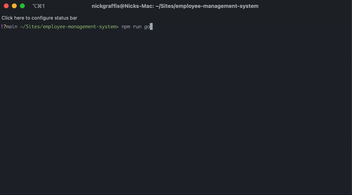
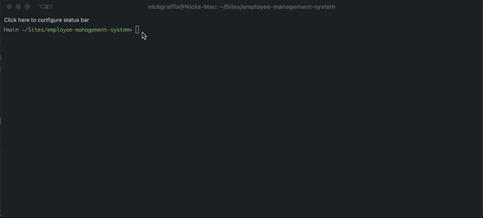

# EIS :) Employee Management System
An easy to use interaction with MySQL database to manage employee names, roles, departments, managers, and salaries.

## Installation
* `cd` into your desired directory
* `git clone https://github.com/nickgraffis/employee-management-system.git`
* `npm install`
* Edit your .env.EXAMPLE file to depict your desired MySQL credentials, and remove the .EXAMPLE extension
* `npm run go`

## Useage
When you start the app, it will first check your database to see if the proper tables are inside, and then create them if they are not.

Once the database is partitioned properly you will be prompted a list of options. Follow along to perform your desired tasks.

Here is a list of options:

```javascript
choices: [
  "View All Employees",
  "View Employees by Department",
  "View Employees by Role",
  "View Employees by Manager",
  "Add a Department",
  "Remove a Department",
  "Add a Role",
  "Remove a Role",
  "Add an Employee",
  "Remove an Employee",
  "Update an Employee's Role",
  "Update an Employee's Manager",
  "View Utilized Budget by Department",
  "^C (EXIT)"
]
```

## Demos

### Creating from scratch


### Tooling around


### Common errors
Error handling tries to provide something as helpful as possible. The biggest error by far is <strong> not properly updating your .env file</strong>!
